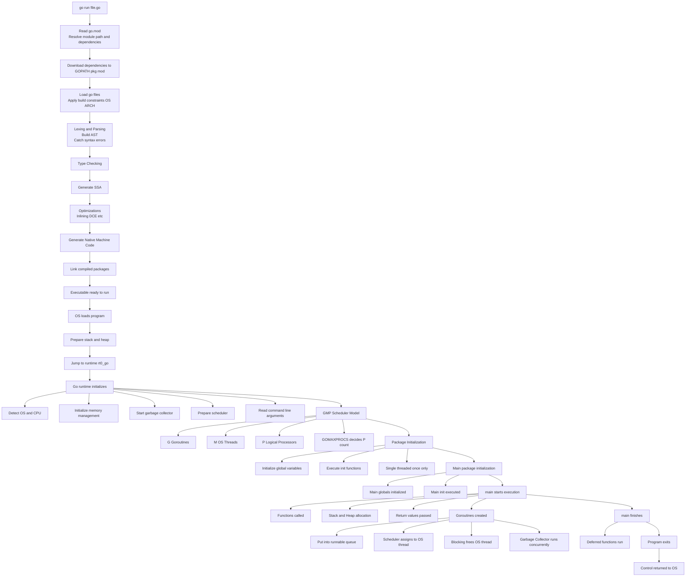

# How it Goes

## 1. `go run file.go`
Go looks into `go.mod` for module path, version and dependencies -> dependencies are resolved according to the `go.mod` file and stored in the `$GOPATH/pkg/mod` -> all `.go` files are loaded and build constraints applied according to the OS -> Source code is converted to tokens and Abstract Syntax Tree (AST) is built. Syntax errors are caught here -> type checking happens -> SSA (static single assignment) is generated from the code -> optimization [dead code elimination, inlining and stuff like that] -> machine code generation [native machine code not byte code] -> compiled packages are combined -> redy to run.
###### This is the build process.

## 2. OS loads the program
Loads the program into memory, prepares stack and heap, jumps to the Go runtime entry point (`runtime.rt0_go `)

## 3. Go runtime initializes
Detects OS and CPU architecture, sets memory management, starts garbage collector, prepares sheduler, reads command line arguments.

## 4. G-M-P
G -> goroutines, M -> OS thread, P -> logical processor. `GOMAXPROCS` decides how many P is allocated and now the shceduler is redy.

## 5. Packages are initialised
For each imported package; global variables initialised, `init()` executed. all this happens once and in single thread.

## 6. `main` initialised
main package variables are initialised and main packages `init()` is executed.

## 7. `main()` starts executing
functions are called, memories are allocated on stack or heap, return values are passed back.

## 8. Goroutines are created
goroutines are put in queue and scheduler decides when it is run. scheduler picks a runable goroutine, runs it on the os thread.if a goroutine reads from a channel, sleeps or makes system calls then that goroutine is paused and the os thread is freed so another goroutine can run.

## 9. Garbage Collection runs in the background concurrently (mostly)

## 10. `main()` finishes
`main()` returns, deferred functions are run.

## 11. Program Exits
when `main()` returns and no goroutines are running.

## 12. Controll is released to the OS
Go is now Gone.

# Why it Goes

#### 1. Built for concurrency, goroutines are cheap (KBs for memory), channels make coordination safer. JAVA -> heavy threads, Node.js single threaded (event loop), Python concurrency limited by GIL.
#### 2. High Performance due to being compiled to native binary. Faster than Python and Node safer than C++.
#### 3. Production ready standard library
#### 4. Great for microservices due to light weight threads and super fast startup.
##### The core phyloosophy of go is simplicity, concurrency, productivity and explicitness.